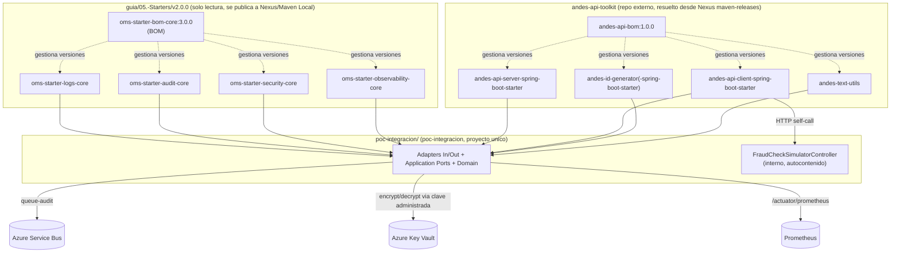
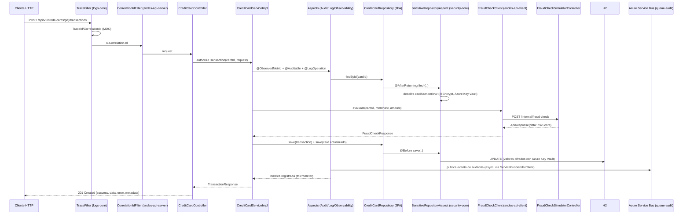

# Arquitectura del Proyecto Final (Pattern 10)

## Vision general



## Flujo: autorizar una transaccion de tarjeta de credito



## Estructura modular (Pattern 02)

Cada starter en `guia/05.-Starters/v2.0.0/<starter>` y en `andes-api-toolkit/` sigue su propia
variante *core* (con `AutoConfiguration.imports`, anotaciones propias y `properties` tipadas).
Este proyecto es el *consumidor* unico de todos ellos:

```
poc-integracion/
├── settings.gradle              # rootProject.name = poc-integracion
├── build.gradle                  # BOMs Galaxy + Andes, dependencias, JaCoCo
├── src/main/resources/openapi/
│   ├── openapi-creditcard.yaml   # contrato API-first servidor (Pattern 03)
│   └── openapi-fraudcheck.yaml   # contrato cliente fraude (Pattern 03)
├── src/main/java/.../creditcard/
│   ├── application/port/in|out    # puertos hexagonales
│   ├── application/service         # caso de uso
│   ├── infrastructure/adapter      # adaptadores in/out
│   ├── entity/repository/fraud     # persistencia + cliente andean
│   └── dto/mapper/commons          # modelos de aplicacion
└── src/test                       # pruebas unitarias + integracion
```
