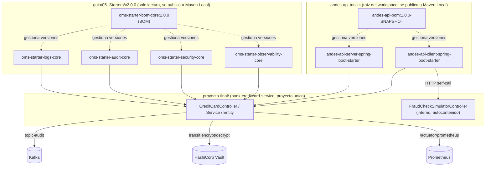
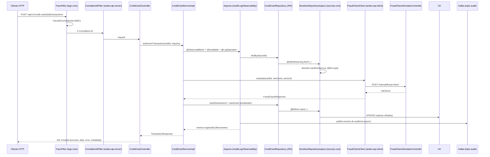

# Arquitectura del Proyecto Final (Pattern 10)

## Vision general



## Flujo: autorizar una transaccion de tarjeta de credito



## Estructura modular (Pattern 02)

Cada starter en `guia/05.-Starters/v2.0.0/<starter>` y en `andes-api-toolkit/` sigue su propia
variante *core* (con `AutoConfiguration.imports`, anotaciones propias y `properties` tipadas).
Este proyecto es el *consumidor* unico de todos ellos:

```
proyecto-final/
├── settings.gradle              # rootProject.name = bank-creditcard-service
├── build.gradle                  # BOMs Galaxy + Andes, dependencias, JaCoCo
├── contracts/
│   └── openapi-creditcard.yaml   # contrato API-first (Pattern 03)
├── src/main/java/.../creditcard/
│   ├── entity / repository        # persistencia + security-core
│   ├── service / service.impl     # logs-core + audit-core + observability-core
│   ├── fraud/                     # andes-api-client (cliente) + simulador (andes-api-server)
│   ├── controller                  # andes-api-server (envelope, correlation, errores)
│   └── dto / mapper / commons
└── src/test                       # pruebas unitarias + integracion
```
